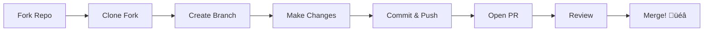

```mermaid
mindmap
  root((Me))
    💻 Coding
      Frontend
      Backend
      Mobile
    🎨 Design
      UI/UX
      Graphic Design
      Prototyping
    📚 Learning
      New Tech
      Best Practices
      Architecture
    🤝 Community
      Open Source
      Mentoring
      Contributing
```

🚀 ULTIMATE GUIDE: Bikin GitHub Profile & Repository Jadi KEREN BANGET!

Saya akan kasih semua komponen yang bisa bikin GitHub kamu aesthetic, profesional, dan stunning! ✨

---

📌 BAGIAN 1: GITHUB PROFILE (README.md di Profile)

1.1 Header dengan Typing Effect


<div align="center">
  


# 👋 Hi, I'm [NAMA KAMU]!

<p align="center">
  
</p>


</div>

---

1.2 Social Media Badges Keren


<div align="center">
  
[](https://github.com/username)
[](https://linkedin.com/in/username)
[](https://twitter.com/username)
[](https://instagram.com/username)
[](https://youtube.com/username)
[](https://portfolio.com)

</div>

---

1.3 Profile Views Counter


<div align="center">
  


[](https://hits.seeyoufarm.com)

</div>

---

1.4 About Me dengan Emoji Animasi


##  **About Me**

```yaml
name: "Your Name"
location: "City, Country"
current_work: "Company/Startup"
education:
  [
    "Bachelor's in Computer Science",
    "Self-taught Developer"
  ]
fields_of_interests:
  [
    "Web Development",
    "UI/UX Design",
    "Mobile Apps",
    "Open Source"
  ]
currently_learning: ["React Native", "Machine Learning", "Rust"]
hobbies: ["Gaming", "Photography", "Reading", "Traveling"]
```



</div>

---

1.5 Tech Stack dengan Icons Keren


##  **Tech Stack**

<div align="center">

### 🚀 **Frontend**


### ⚙️ **Backend**


### 🗄️ **Database**


### 🛠️ **Tools**


</div>

---

1.6 GitHub Stats Card Keren


##  **GitHub Analytics**

<div align="center">
  
### 📊 **Profile Stats**
[](https://git.io/streak-stats)

### 📈 **Contribution Stats**


### 📉 **Top Languages**


### 📚 **Wakatime Stats** *(jika pakai Wakatime)*


</div>

---

1.7 3D Contribution Graph


##  **3D Contribution Graph**

<div align="center">
  


</div>

---

Cara setup: https://github.com/yoshi389111/github-profile-3d-contrib

1.8 Snake Animation


##  **Contribution Snake**

<div align="center">
  


</div>

---

Cara setup: https://github.com/Platane/snk

---

📌 BAGIAN 2: REPOSITORY README

2.1 Header dengan Banner


<div align="center">
  
#  **PROJECT NAME** 


[](LICENSE)
[](https://github.com/username/project/releases)
[](https://github.com/username/project/stargazers)
[](https://github.com/username/project/releases)

<p align="center">
  <i>✨ Short description about your awesome project goes here ✨</i>
</p>


</div>

---

2.2 Demo/GIF Showcase


##  **Demo**

<div align="center">

### 🎥 **Live Preview**


### 📸 **Screenshots**

| Home Page | Dashboard | Settings |
|:---------:|:---------:|:--------:|
|  |  |  |

### 🎬 **Video Demo**
[](https://youtu.be/VIDEO_ID)

</div>

---

2.3 Features dengan Icons Grid


##  **✨ Features**

<div align="center">

| | | |
|:---:|:---:|:---:|
| <br/>**Lightning Fast** | <br/>**Secure** | <br/>**Mobile Ready** |
| <br/>**Analytics** | <br/>**Cloud Sync** | <br/>**Customizable** |
| <br/>**Notifications** | <br/>**API Ready** | <br/>**Scalable** |

</div>

---

2.4 Installation dengan Terminal Animation


##  **📦 Installation**

<div align="center">

```bash
# Clone repository
git clone https://github.com/username/project.git

# Navigate to directory
cd project

# Install dependencies
npm install

# Run the project
npm start
```

📦 Package Managers

https://img.shields.io/badge/npm-CB3837?style=for-the-badge&logo=npm&logoColor=white
https://img.shields.io/badge/Yarn-2C8EBB?style=for-the-badge&logo=yarn&logoColor=white
https://img.shields.io/badge/Homebrew-FBB040?style=for-the-badge&logo=homebrew&logoColor=black
https://img.shields.io/badge/Docker-2496ED?style=for-the-badge&logo=docker&logoColor=white

</div>

---

2.5 Tech Stack dengan Icons


##  **🛠️ Built With**

<div align="center">

### **Frontend**


### **Backend**


### **DevOps**


</div>

---


2.6 Project Structure dengan Tree


##  **📁 Project Structure**

```text
📦 project-name
├── 📂 src
│   ├── 📂 components
│   │   ├── 📄 Header.jsx
│   │   ├── 📄 Footer.jsx
│   │   └── 📄 Sidebar.jsx
│   ├── 📂 pages
│   │   ├── 📄 Home.jsx
│   │   ├── 📄 About.jsx
│   │   └── 📄 Contact.jsx
│   ├── 📂 utils
│   │   ├── 📄 helpers.js
│   │   └── 📄 constants.js
│   └── 📄 App.jsx
├── 📂 public
│   ├── 📄 index.html
│   └── 📄 manifest.json
├── 📄 package.json
├── 📄 README.md
└── 📄 .gitignore
```

Atau dengan Mermaid


</div>
---

2.7 API Documentation dengan Cards


##  **🔌 API Endpoints**

<div align="center">

| Method | Endpoint | Description | Auth |
|:------:|:---------|:------------|:----:|
| 🟢 GET | `/api/users` | Get all users | ✅ |
| 🟡 POST | `/api/users` | Create user | ✅ |
| 🔵 PUT | `/api/users/:id` | Update user | ✅ |
| 🔴 DELETE | `/api/users/:id` | Delete user | ✅ |

### **📦 Request/Response Example**

<details>
<summary><b>📤 Create User Request</b></summary>

```json
{
  "name": "John Doe",
  "email": "john@example.com",
  "password": "secure123"
}
```

</details>

<details>
<summary><b>📥 Create User Response</b></summary>

```json
{
  "status": "success",
  "data": {
    "id": 1,
    "name": "John Doe",
    "email": "john@example.com",
    "created_at": "2024-01-01T00:00:00Z"
  }
}
```

</details>

</div>

---

2.8 Contributing Guide dengan Animasi


##  **🤝 Contributing**

<div align="center">

### **✨ How to Contribute**



📝 Contribution Guidelines

Step Action Description
1 🍴 Fork Fork repository ke akun kamu
2 📥 Clone git clone https://github.com/username/project.git
3 🌿 Branch git checkout -b feature/amazing-feature
4 ✨ Code Write awesome code
5 ✅ Test Run tests and ensure quality
6 📤 Push git push origin feature/amazing-feature
7 🔃 PR Open Pull Request

🏆 Contributors

<a href="https://github.com/username/project/graphs/contributors">
  
</a>

</div>

2.9 License dengan Badge


##  **📜 License**

<div align="center">

Copyright © 2024 [Your Name]

This project is licensed under the **MIT License** - see the [LICENSE](LICENSE) file for details.

[](LICENSE)

</div>

2.10 Footer yang Keren


<div align="center">
  


##  **Support the Project** 

### ⭐ **Star this repository** if you found it useful!

[](https://github.com/username/project/stargazers)
[](https://github.com/username)
[](https://twitter.com/username)

### 💖 **Sponsor**
[](https://github.com/sponsors/username)
[](https://www.buymeacoffee.com/username)

---

### 📱 **Connect With Me**

[](https://github.com/username)
[](https://linkedin.com/in/username)
[](https://twitter.com/username)
[](mailto:email@example.com)

**Made with ❤️ by [Your